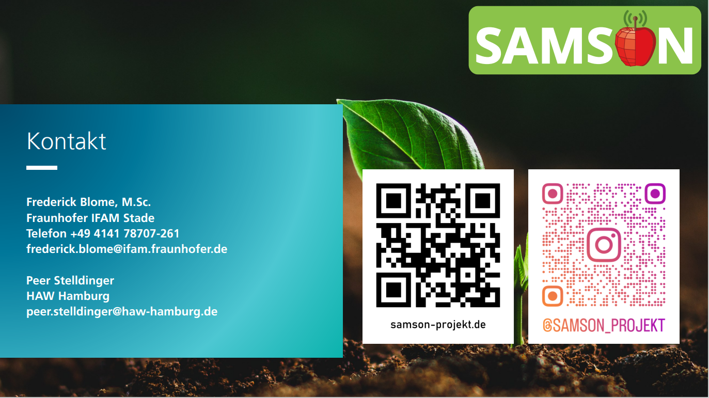
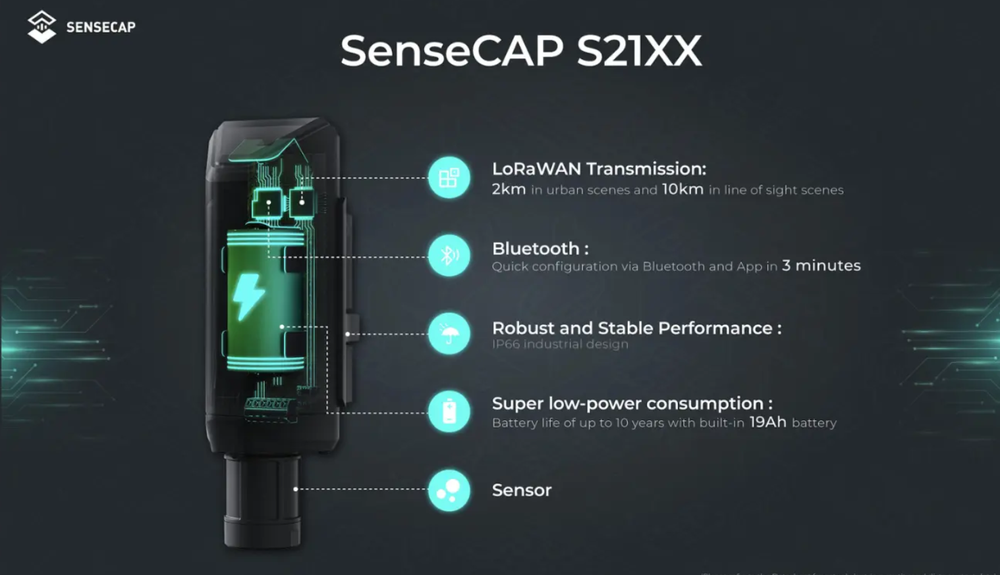
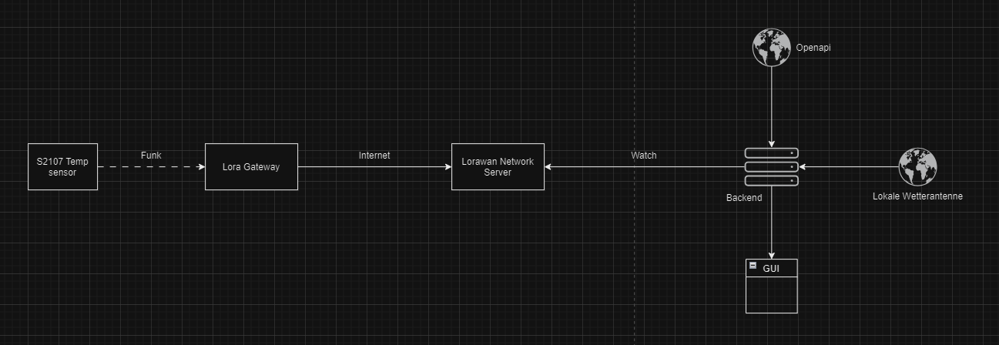

# Samson Project

The Samson aims to automate and optimize water usage through soil moisture sensors, weather data integration, and an efficient irrigation system to improve apple yield and conserve resources. This system will reduce water waste, enhance crop quality, and support sustainable farming practices.

Here's why:
* about 1/3 of all stretchers are lost every year and this could be optimized causing a great impact on society
* Saving time by using the latest technology can greatly increase productivity and make life easier for farmers
* Optimizing losses and time, the possibility of increasing the quantity of product and quality, could make food cheaper to a certain extent

<!-- GETTING STARTED -->
## Getting Started

As the project is large and we wouldn't be able to handle everything due to time constraints, our priorities and objectives were located in the area of temperature measurement in the fields.

### Prerequisites

In order to be able to implement ourselves and better understand how we could achieve our goal and get a more precise answer, we would first need to gather knowledge of how microcontrollers and the current technologies used work.

To do this, we set ourselves some learning objectives for the project and for our group. These are:

1. Learn how a microcontroller works using an arduino (the microcontroller available)
2. learn how to run a server on a raspberry if necessary (which wasn't the case)
3. understand the current project and the requirements as a whole
4. Being able to analyze and prioritize the entire project using design thinking methods

<!-- ROADMAP -->
## Roadmap

- [x] Problem definition
- [x] Use structured methods to visualize possible problems and solutions
- [x] Learning to use microcontrollers and microcomputers
- [x] Find hardware that is effective and within the given parameters
- [x] Creating an architectural design
- [x] Making a prototype

<!-- DEFINITION AND IDEALIZATION -->
## Defining the problem and idealizing the solution

We were given the objective of being able to think about the problem with at least 2 different techniques and that's what we did.

1. First we start with a simple way of solving and thinking about the problem. We use the 5w method because it's simple and shows a lot about where our problem is headed.

2. As a second option, we like to find out what the causes of the current problems are and differentiate between what the problems really are and visualize the situation as a whole. At this point we like to choose the problem tree to define this

3. In order to think of the most feasible solution, we like to follow the Disney method, because we are able to think together and discuss ideas in a structured way, showing various ways in which the project can be developed and adapted according to different ideas.

   
<!-- LEARNING EXPERIENCE -->
## Learning experience

Once we had finished writing down the problems and looking for solutions in the theoretical part, we decided to move on to the phase of testing solutions and understanding how they would work in practice.

With the arduino in hand, we were able to test various attachments and see how the data input would really work and use it in a way that we could gather the information we needed

With the Rasberry we were able to test and run a server locally if necessary, but we saw that we didn't need that, as a server running in the cloud or anywhere else would work just as well. This server would be collecting local information from the various sensors passing through the lorawan network and being monitored by the server at all times. The server receives data from the existing local antennas at the same time, as well as data from the OpenAPI in the Hamburg area, so that we have the most accurate data possible. All of this is being compared so that there is as little error as possible.

## Hardware

When it came to choosing the hardware, we had a very good set of requirements and we did a lot of research to find the best fit.

Our requirements were to find a solution that:

- cost-effective
- compact
- Energy-saving (battery life  >3 years)
- Radio-based
- Measuring frequency: 10 min
- Measuring accuracy: ± 0.5°C

### Our choice: SenseCAP S2107

- Designed to Use in Harsh Environments: -40℃ ~ 85℃ operating temperature(LoRa DTU) and IP66-rated enclosure, the PT1000 probe can detect -50~300℃, suitable for outdoor use, high UV exposure, heavy rain, dusty conditions, etc.
- Compatible with Worldwide LoRaWAN® Networks: Compatible with different types of LoRaWAN® gateways to enable fast connection with LoRaWAN® networks (support the universal frequency plan from 863MHz ~928MHz).
- Long Range & Battery powered: Ultra-wide-transmission range of 2km in urban scenes and 10km in line of sight scenes. Powered by easily replaceable standard Li-SOCl2 battery (type: ER34615) with Max.10 years of battery life.
- Simple Configuration and Calibration: SenseCAP provides a no-code experience that enables users to finish configuration and calibration through SenseCAP Mate APP.

#### SenseCAP 2107 Links

[Main Website](https://www.seeedstudio.com/SenseCAP-S2107-Temperature-Sensor-p-5807.html)

[User Guide](https://wiki.seeedstudio.com/SenseCAP_S2107/)

[Website to buy in germany](https://www.antratek.de/sensecap-s2107-lorawan-temperature-sensor-with-pt1000)

## Creating an architectural design

<!-- CONTACT -->
## Contact

Your Name - [@your_twitter](https://twitter.com/your_username) - email@example.com

Project Link: [https://github.com/your_username/repo_name](https://github.com/your_username/repo_name)

(<a href="#readme-top">back to top</a>)

